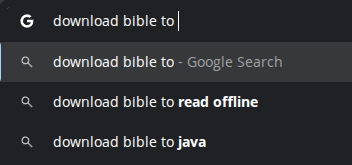

# Fast Bible

Fast Bible is a small Go project that loads a Portuguese Bible dataset from JSON, normalizes the verses, and indexes them into Elasticsearch for fast full-text search.

The project does not expose its own HTTP API yet. Its current responsibility is data ingestion: read the local Bible file, create an Elasticsearch index, and insert each verse as a searchable document. After indexing, you can query Elasticsearch directly with tools like Kibana, Insomnia, Postman, or `curl`.



## What this project does

When you run the app:

1. It reads `app/aa.json`, which contains the Bible text in Portuguese.
2. It cleans the verse text by removing extra spaces and a few unwanted characters.
3. It connects to Elasticsearch at `http://localhost:9200`.
4. It creates an index named `bible` if it does not already exist.
5. It indexes each verse as a document with:
   - `book`
   - `chapter`
   - `number`
   - `verse`

Each document ID follows this format:

```text
<Book>-<Chapter>-<VerseNumber>
```

Example:

```text
João-14-6
```

## Project structure

```text
.
├── app/
│   ├── aa.json
│   ├── elasticsearch/
│   │   └── elasticsearch.go
│   ├── extract/
│   │   └── extract.go
│   └── main.go
├── go.mod
├── go.sum
└── README.md
```

## Dependencies

To run this project locally, you need:

- Go `1.25+` installed locally
- Elasticsearch running on `http://localhost:9200`

Go dependencies are already declared in `go.mod`. The main ones are:

- `github.com/elastic/go-elasticsearch/v9`
- `github.com/elastic/elastic-transport-go/v8`
- `github.com/dslipak/pdf`

Note: `github.com/dslipak/pdf` is present in `go.mod`, but the current code path reads from JSON and does not use PDF extraction.

## How to run

### 1. Start Elasticsearch

The application expects Elasticsearch on port `9200`.

One simple way to run it is with Docker:

```bash
docker run --name fast-bible-es \
  -p 9200:9200 \
  -e discovery.type=single-node \
  -e xpack.security.enabled=false \
  docker.elastic.co/elasticsearch/elasticsearch:9.1.0
```

Then verify it is up:

```bash
curl http://localhost:9200
```

### 2. Install Go dependencies

From the project root:

```bash
go mod download
```

### 3. Run the indexer

```bash
go run ./app
```

If Elasticsearch is available, the app will create the `bible` index and insert all verses from `app/aa.json`.

## How to search

After indexing, query Elasticsearch directly.

Example using query string search:

```bash
curl "http://localhost:9200/bible/_search?q=a%20verdade%20e%20a%20vida"
```

Example using a JSON request body:

```bash
curl -X GET "http://localhost:9200/bible/_search" \
  -H "Content-Type: application/json" \
  -d '{
    "query": {
      "match": {
        "verse": "a verdade e a vida"
      }
    }
  }'
```

## Indexed document format

Each verse is stored as a document like this:

```json
{
  "number": 6,
  "chapter": 14,
  "book": "João",
  "verse": "Respondeu-lhe Jesus: Eu sou o caminho, e a verdade, e a vida; ninguém vem ao Pai, senão por mim."
}
```

The index mapping created by the app is:

- `book`: `keyword`
- `chapter`: `integer`
- `number`: `integer`
- `verse`: `text`
